# AutoInvoice

## Repository
The Github repository for AutoInvoice can be found here:
[Github repository for AutoInvoice](https://github.com/)

## Purpose

The purpose of an AutoInvoice demo website is to demonstrate the capabilities of an invoice extraction system with the help of NN model. 

Invoice extraction is a process of automatically extracting data from invoices, such as vendor information, product details, and amounts, and transforming it into structured information that can be easily processed and analysed. 

The demo website allows users to see how the invoice extraction system works, by uploading sample invoices and seeing the extracted information displayed in a clear and organised manner. 

The demo website can also be used to showcase the different features and benefits of the invoice extraction system, such as improved efficiency compared to manual data entry. 

The demo website is used as a marketing tool to attract potential customers and provide them with a hands-on experience with the product.

## Functionality / Features

* Register/login: Users are able to register and login and then explore the features that the system has to offer
* Uploading: Users are able to upload sample invoices for the invoice extraction system to process
* Data extraction: The website will demonstrate how the invoice system can automatically extract key/value information, such as vendor name, invoice number, product details and etc.
* Structured data output: The display of the extracted information in a structured format to show how it can be easily processed and analysed.
* User in the loop: User can easily modified the extracted data as if the system made mistake extracting some of the information.
* User friendly UI: The UI is designed for easier user and system interaction.

## Target Audience

The target audience of AutoInvoice Demo website may include the following:

* Small business owners: Small business owners who process a large number of invoices and want to streamline their accounting and financial processes.

* Accounts payable departments: Accounts payable departments in larger organisations who are responsible for processing invoices and managing payments.

* Financial professionals: Financial professionals who want to improve efficiency in their accounting and financial processes.

## UX/UI design documentation

* As a small business owner, I want to organise and edit invoices to send to my clients for ease of client understanding and keeping my books in order.

* As part of the accounts payable department of my company, I want a way to process invoices in a clear and manageable way to better organise and manage payments.

* As a financial professional, I want to improve efficiency in my accounting and financial process to better utilise my time and energy.

## Tech Stack

Website:
* Front-end: React
* Back-end: Express.js
* Data store: MongoDB
* Environment: Node.js

Model API:
* Flask for constructing the API
* LayoutLMV3 is the chosen model for invoice extraction
* Python is used for pre-processing and post-processing logic

## Dataflow Diagram

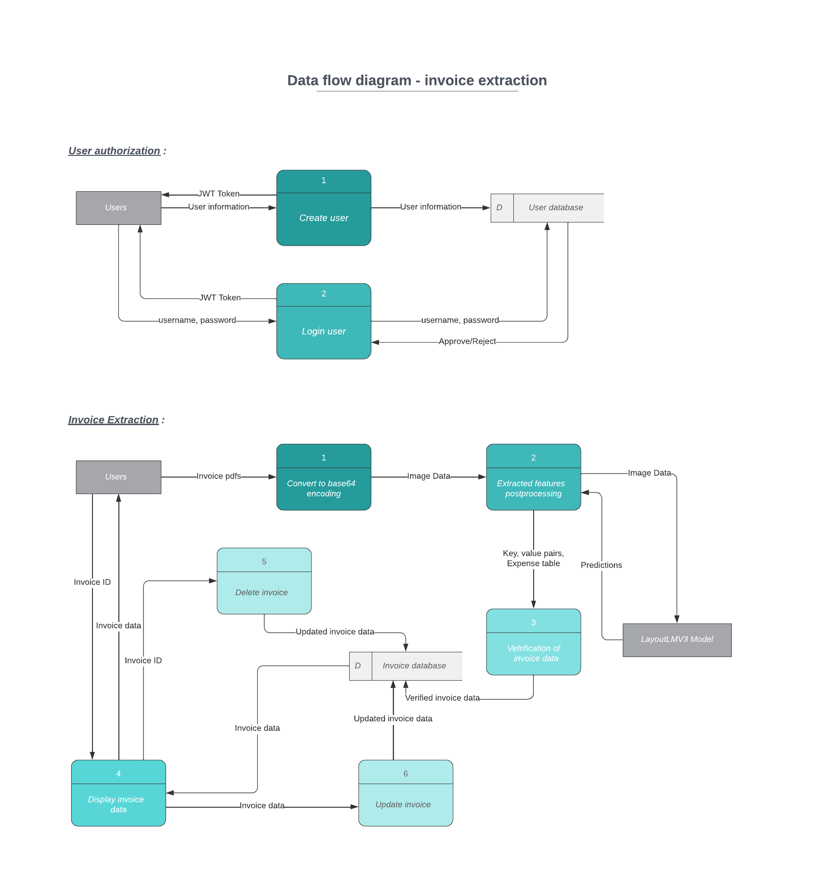

## Application Architecture Diagram

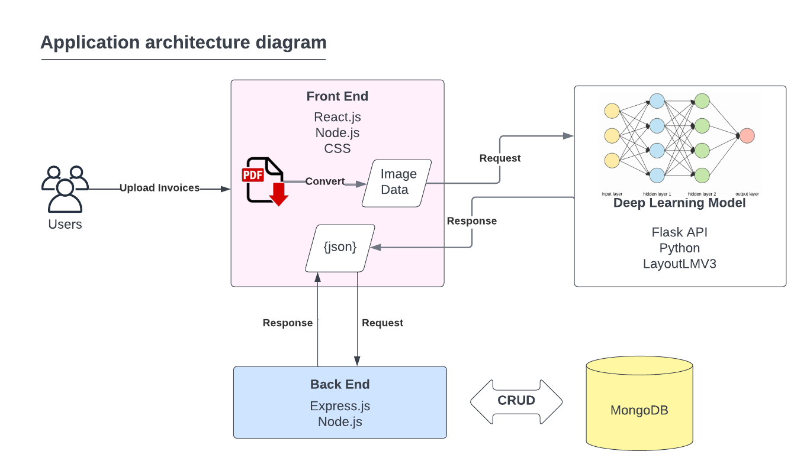

## Wireframes

These are the basic wireframes for the application

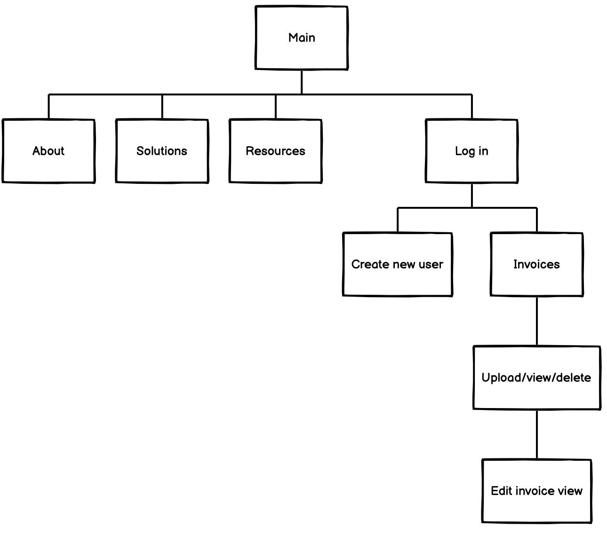
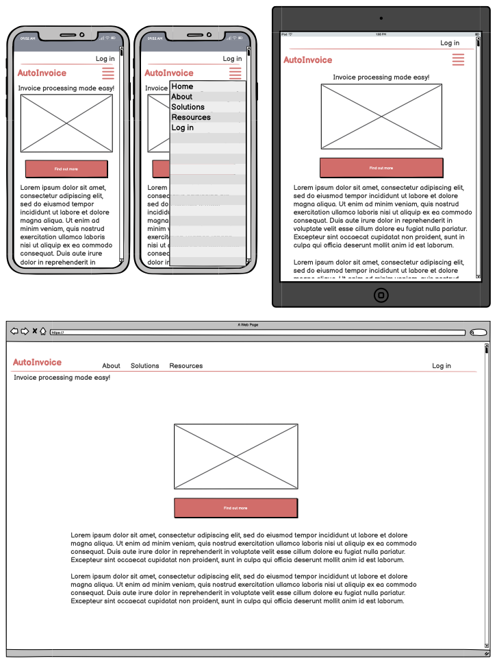
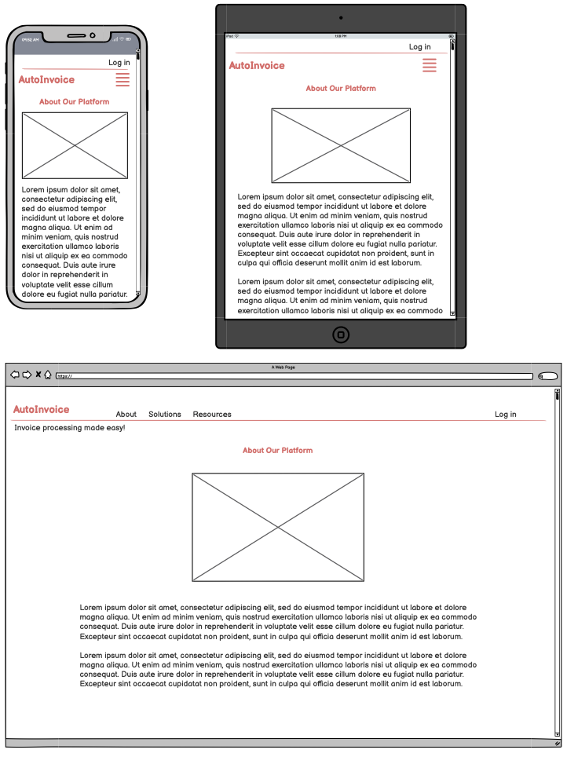
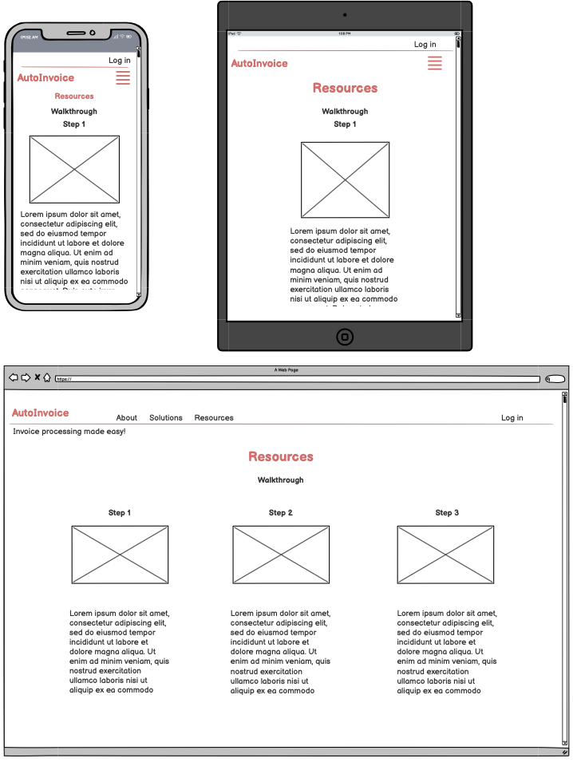
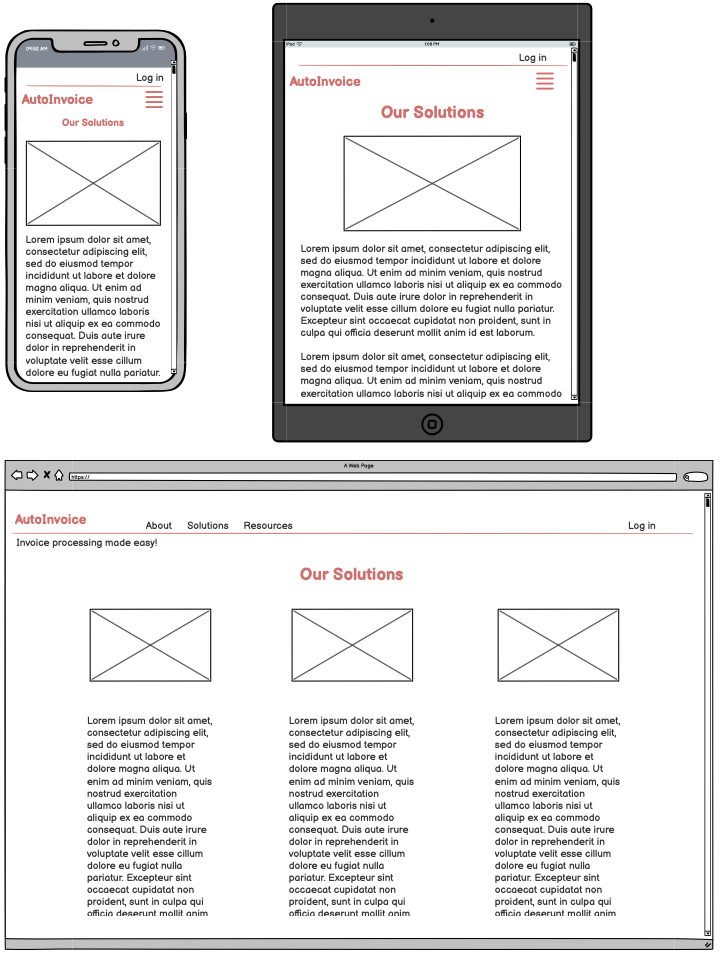
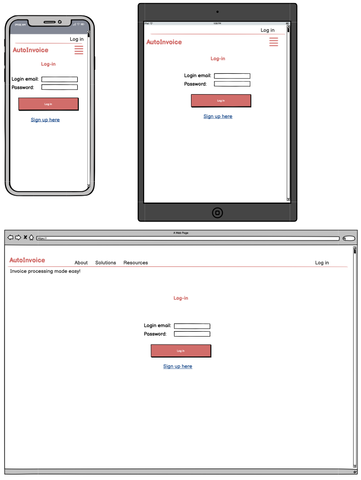
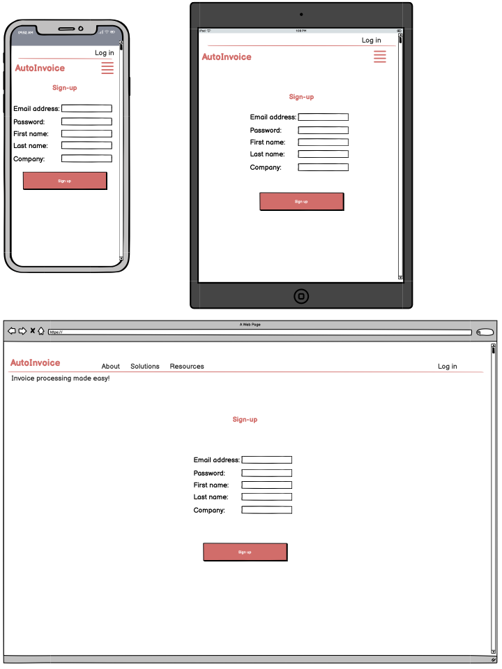
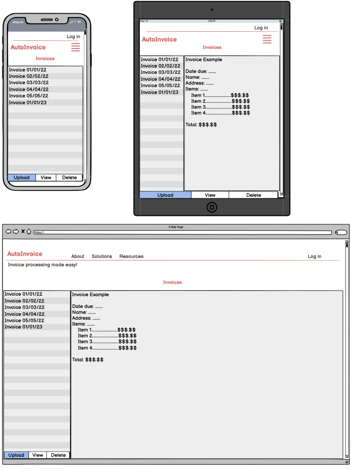
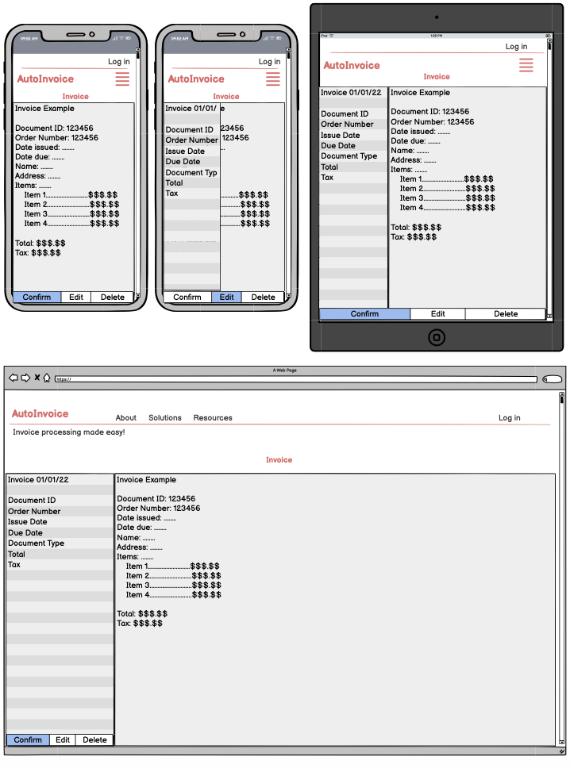

## Trello board

Our team utilised Trello for planning and workflow. Our Trello board can be found here:
[Trello Board Link](https://trello.com/b/lkLZY97l/t3a2)

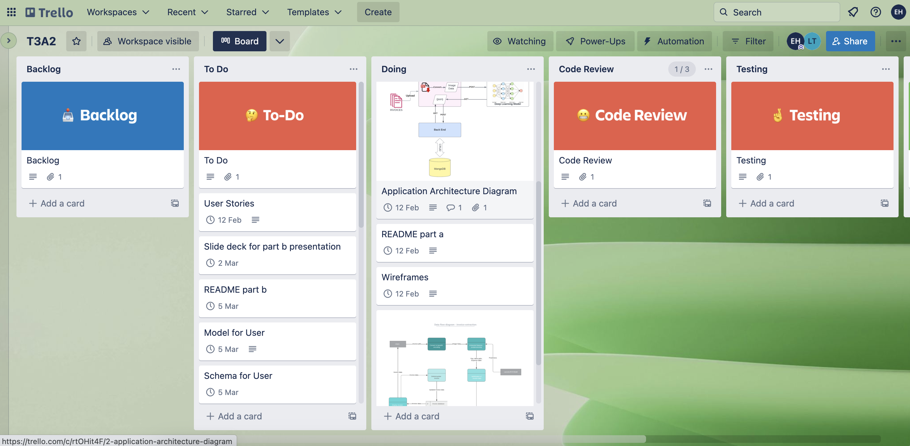

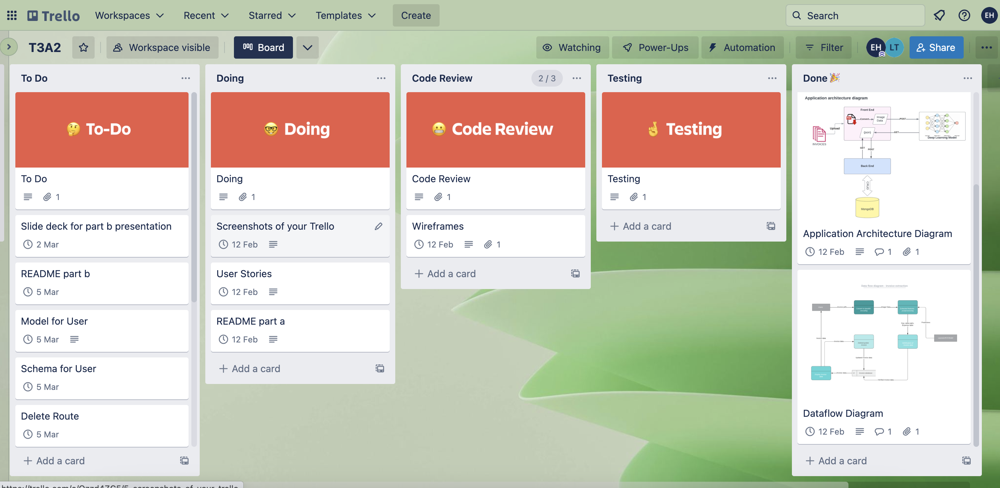

